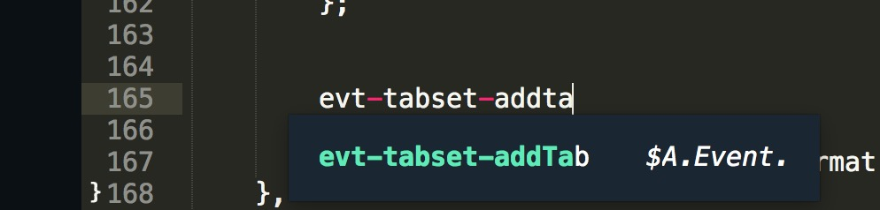
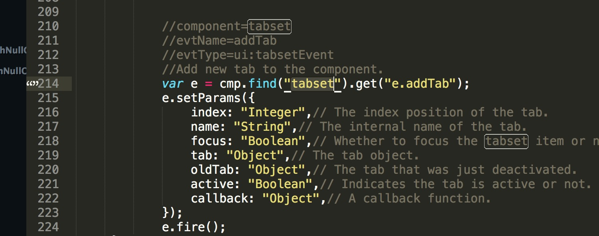
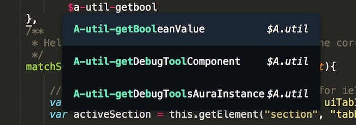
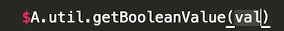
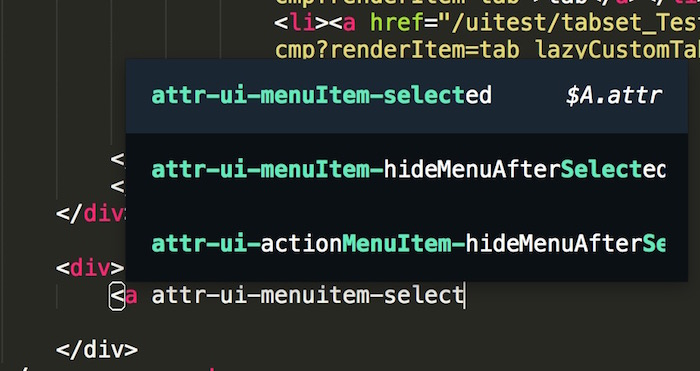
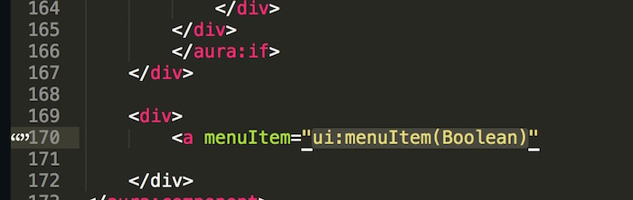
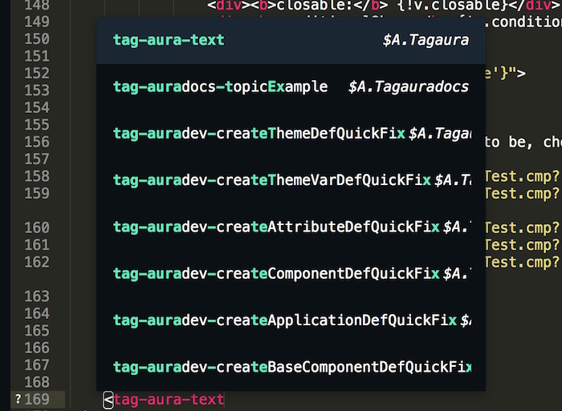
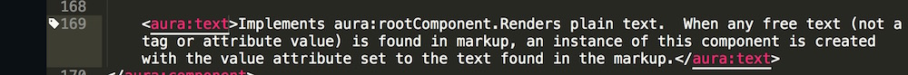

# Salesforce Aura (Lightning)  Autocomplete for Sublime Text 3


## To Compile the autocomplete from Aura githu
```
   #download and install node
   #if you use home brew
   brew install node

   #run this
   npm install 
   
   node generateJsAutoComplete.js /Users/sle/git/aura ;
   node generateXmlAutoComplete.js /Users/sle/git/aura ;

   #install it on local
   sh install.sublime.sh
```

## Install on Sublime Text 
```
	sh install.sublime.sh
```


## Instruction Sublime Text 
You can hit tab to select the completion as well as navigate through parameters


## To autocomplete an Aura event type
```
	Trigger:
	evt-{COMPONENT_NAME}-{EVENT_NAME}

	Example:
	evt-search


	Outcome:
	You should get 
		//component=inputSearch
        //evtName=search
        //evtType=ui:searchEvent
        //The event fired when the user runs a search.
        var e = cmp.find("inputSearch").get("e.search");
        e.setParams({
            type: "String",// The type of search event that was fired.
            context: "Object",// Context relevant to the search event that was fired.
            searchTerm: "String",// The term that was specified to search.
        });
        e.fire();
```




## To autocomplete an Aura Test js method
```
	Trigger:
	$a-test-{TEST_METHOD_NAME}

	Example:
	$A.test.assertTru

	Output:
		You should get this
			$A.test.assertTruthy(condition,assertMessage)
```


## To autocomplete an Util Test js method
```
	Trigger:
	$a-util-{UTIL_METHOD_NAME}

	Example:
	$A-util-getbool

	Output:
		You should get this
			$A.util.getBooleanValue(val)
```




## To autocomplete an aura attribute
```
	Trigger:
	inside a tag
	attr-{NAMESPACE}-{COMPONENT_NAME}-{ATTRIBUTE_NAME}


	Example:
		<a attr-ui-menuitem-select

	Output:
		You should get: this will show which component is suggested along with its value
			<a menuItem="ui:menuItem(Boolean)"
```	




## To autocomplete an aura attribute
```
	Trigger:
	inside a tag
	tag-{NAMESPACE}-{COMPONENT_NAME}-{ATTRIBUTE_NAME}

	Example:
	<tag-ui-inputtext

	Output:
		You should get: this will show which component is suggested along with its value
			<ui:inputText>
				Implements ui:inputTextComponent.
				Represents an input field suitable for entering a single line of free-form text.
			</ui:inputText>
```	




## Install on Atom (WIP): for now this plugin only supports Sublime Text 3
```
  CMD + SHIFT + P
  Type in "snippet"
  Copy and paste aura.snippet.cson to the file and save.
```
