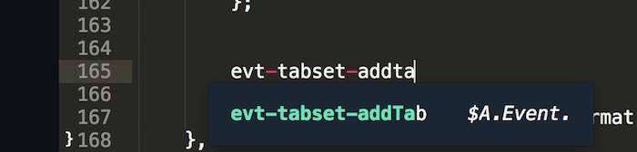
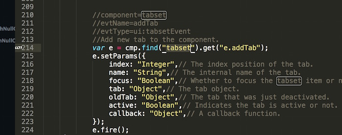

### Salesforce Aura (Lightning)  Autocomplete for Sublime Text 3 [](https://travis-ci.org/synle/aura_autocomplete_sublime)

#### Salesforce Aura (Lightning) Autocomplete
+ [Salesforce Aura Github](https://github.com/forcedotcom/aura)
+ [Sublime Text 3 Instruction](https://github.com/synle/aura_autocomplete_sublime/blob/master/README.sublime.md)


#### Cheatsheet
Please note that anything in {} and - is optional. Instead of attr-ui-menuitem-select, you can simply replace it with attruimenuitemselect. Also you can also skip the component name and type it as attr-menuitem.

Trigger | Example | Description
------- | ------- | -----------
evt-{COMPONENT_NAME}-{EVENT_NAME} | **evt-search** | Autocompelte for events
$a-test-{TEST_METHOD_NAME} | **$A.test.assertTru** | All Test.js functions
$a-util-{UTIL_METHOD_NAME} | **$A-util-getbool** | All Util.js functions
attr-{NAMESPACE}-{COMPONENT_NAME}-{ATTRIBUTE_NAME} | <a **attr-ui-menuitem-select** | all Aura tag attributes
tag-{NAMESPACE}-{COMPONENT_NAME}-{ATTRIBUTE_NAME} |  <**tag-ui-inputtext** | All Aura tag names

#### Screenshots:




#### To Compile the autocomplete from Aura github
```
   #download and install node
   #if you use home brew
   brew install node

   #run this
   npm install 

   #make sure you sync up all the submodule (Salesforce Aura module)
   #might only be needed on the first run
   git submodule init
   #to pull latest and greatest
   git submodule update --recursive

   #to run in a guided mode with prompts
   npm start
   
   #to run in silent mode, please provide the base dir
   npm run pkg

   #install it on local
   sh install.sublime.sh
```

